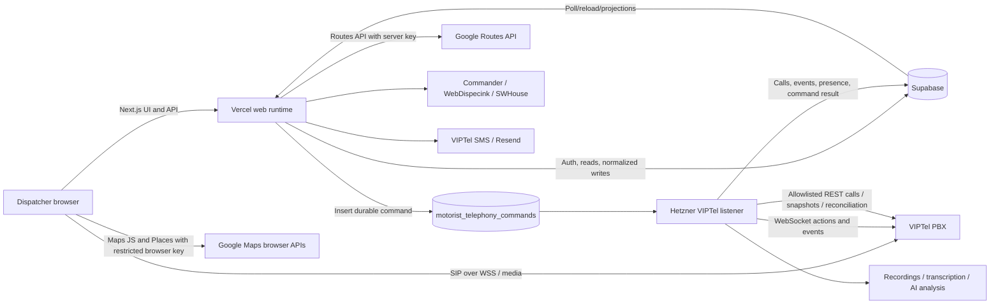
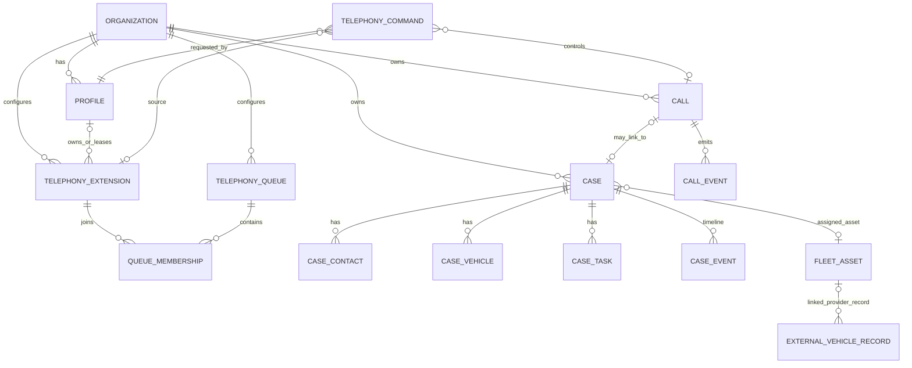

# Pomoc Motoristom Dispatch — AI Project Handoff

This document is a practical orientation guide for a developer or AI assistant joining the project. It describes the current code boundaries, important entities, external systems, and the assumptions that must **not** be made casually.

It is a map, not a substitute for reading the relevant source. The repository changes frequently, especially telephony. Before editing anything, run `git status`, inspect recent commits, and read the files listed for the feature being changed.

## Read this first

1. Read [`AGENTS.md`](./AGENTS.md). It contains repository-specific working and deployment rules.
2. Check the current branch, working tree, and recent history:

   ```bash
   git status --short --branch
   git log -10 --oneline --decorate
   ```

3. Never copy `.env.local`, SIP passwords, API keys, database URLs, tokens, or live payloads into prompts, commits, logs, screenshots, or documentation.
4. Vercel Preview/dev environments may use the live Supabase dataset. A preview deployment is therefore **not necessarily a data sandbox**.
5. VIPTel is a distributed system. The web deployment and the Hetzner listener must be compatible, ideally built from the exact same commit.
6. Do not deploy, run a migration, activate a listener, change PBX configuration, or mutate Hetzner merely because code was edited. Those are separate, explicit operational actions.
7. Some older documents describe intended or historical behavior. Treat the source, current migrations, deployed environment, and live provider evidence as authoritative; verify before relying on an old plan.

## One-minute system picture



The central rule is: **Supabase stores the application truth, VIPTel owns live telephone truth, and the listener reconciles the two.** UI state is not provider confirmation.

## Technology and runtime shape

- Next.js 16 App Router, React 19, TypeScript, Tailwind CSS 4.
- Supabase Auth, Postgres, Storage, and normalized application records.
- VIPTel PBX, event WebSocket, REST API, SMS API, and SIP-over-WebSocket for the browser phone.
- A long-running listener/worker on Hetzner for VIPTel events and durable commands.
- Google Maps JavaScript/Places in the browser and Google Routes on the server.
- Fleet integrations: Commander, WebDispecink, and SWHouse.
- Optional downstream call processing through recordings, ElevenLabs transcription, and Anthropic analysis.
- Vercel hosts the Next.js application. The production branch is normally `main`; development and previews follow the release policy in `AGENTS.md` and [`docs/deployment-vercel.md`](./docs/deployment-vercel.md).

The project is a modular monolith: UI, API handlers, and most business services live in one Next.js repository, while the always-on telephony process is built from the same repository and runs separately.

## Repository map

| Path | Responsibility |
| --- | --- |
| `src/app/page.tsx` | Server entry point. Resolves auth, loads dispatch data, and renders the main console. |
| `src/app/api/**/route.ts` | Authenticated server API boundary. Browser mutations should go through these routes. |
| `src/components/dispatch/DispatchConsole.tsx` | Main application orchestrator and navigation. Large, stateful, and high-risk to edit casually. |
| `src/components/dispatch/` | Dispatch, cases, tasks, phone center, workplace, fleet, attendance, reports, maps, and settings UI. |
| `src/components/dispatch/map/` | Map-specific helpers and components. |
| `src/data/dispatch-repository.ts` | Loads and maps the Supabase records used by the dashboard. Also controls mock fallback behavior. |
| `src/data/dispatch-types.ts` | Aggregate data contract passed into the main UI. |
| `src/data/case-inputs.ts` | Case write/input contracts. |
| `src/domain/types.ts` | Main domain types and shared entity shapes. |
| `src/domain/statuses.ts` | Human labels and status mappings. |
| `src/domain/time.ts` | Shared time handling. Use it instead of inventing timezone formatting. |
| `src/server/motorist-mutations.ts` | Core server-side business mutations for cases and related entities. |
| `src/server/api-auth.ts` | Maps Supabase sessions to an active organization profile and enforces roles. |
| `src/server/access-policy.ts` | Role and access-management rules. |
| `src/server/telephony/` | Telephony authorization, commands, correlation, provider snapshots, routing, workplace leases, takeover, and reconciliation. |
| `src/lib/telephony/` | Browser telephony state, SIP.js lifecycle, call control, phone normalization, transfer helpers, and workplace client logic. |
| `src/lib/integrations/viptel/` | VIPTel REST/provider adapter and provider data parsing. |
| `src/lib/integrations/webdispecink/` | WebDispecink provider adapter. |
| `src/server/integrations/` | Server-side Commander, SWHouse, and other provider services. |
| `src/worker/viptel-listener.ts` | Always-on VIPTel WebSocket listener and command consumer. |
| `src/worker/` | Scheduler, one-shot jobs, alerts, runtime ledger, and listener entry points. |
| `supabase/migrations/` | Ordered database schema and RLS changes. Never edit an already-applied migration. |
| `deploy/` | Hetzner/container/release scripts, runtime config, and manual Supabase operational artifacts. |
| `scripts/` | Local probes, smoke tests, sync/discovery helpers, and demo seed scripts. |
| `tests/`, `e2e/`, colocated `*.test.ts` | Infrastructure, integration-contract, UI, and Playwright tests. |
| `docs/` | Architecture, data model, integration strategy, and operational runbooks. Some plans may be historical. |

## Application entry and data flow

`src/app/page.tsx` does roughly this:

1. Resolve the current Supabase session and application profile.
2. Show the login UI if no valid actor exists.
3. Call `loadDispatchData()` from `src/data/dispatch-repository.ts`.
4. Pass the aggregate result to `DispatchConsole`.

`DispatchData` contains the dashboard projection: cases, calls, operators, attendance, users, branches, contacts, fleet assets, provider vehicles, notifications, integration health, metrics, and telephony statistics.

The repository reports whether data came from `supabase` or `mock`. Missing configuration or a failed Supabase read can produce a mock warning in permitted development contexts. Never treat a nice-looking UI as evidence that live data loaded. Production behavior must fail safely instead of silently presenting demo state.

Browser code generally must not write directly to Supabase. It calls `src/app/api/**`, which authenticates the actor and uses server-only services/credentials.

## Identity, tenancy, and roles

Every business record is scoped by `organization_id`. Do not select or mutate records using an ID alone when organization scope is available.

The important identity distinction is:

- Supabase Auth user: login identity.
- `motorist_profiles`: application identity, role, active state, and organization membership.
- Telephony extension/workplace assignment: a separate operational resource owned or leased by a profile.

Supported application roles are:

- `dispatcher`
- `senior_dispatcher`
- `manager`
- `admin`

Do not assume an authenticated user is automatically an active operator, owns a telephone extension, or may perform manager actions. Use `src/server/api-auth.ts`, `src/server/access-policy.ts`, and telephony-specific access services.

`MOTORIST_DEV_AUTH_BYPASS` is an explicit local-development escape hatch. It must remain disabled in production and preview-like environments.

## Core entity relationships



Principal table groups include:

- Organization and people: `motorist_organizations`, `motorist_profiles`, organization-profile/access tables, operator status tables.
- Cases: `motorist_cases`, `motorist_case_contacts`, `motorist_case_vehicles`, `motorist_case_tasks`, `motorist_case_events`.
- Telephony: `motorist_telephony_lines`, `motorist_telephony_queues`, `motorist_telephony_extensions`, memberships/snapshots, `motorist_calls`, `motorist_call_events`, recordings, and `motorist_telephony_commands`.
- Operations and maps: locations, branches, fleet assets, route estimates, external vehicle records and links.
- Messaging/integrations: SMS messages/attempts, raw integration events, notifications, transcripts.
- Audit and runtime: `motorist_audit_log`, worker/job runtime records, workplace leases/operations/bootstrap receipts.

Use [`docs/data-model.md`](./docs/data-model.md), the migrations, and generated Supabase database types together. A document can lag behind a migration.

## Cases, tasks, and the dispatcher UI

A call and a case are deliberately different:

- Every real call should have durable history.
- A call may be informational and never become a case.
- A call may link to an existing case or create a new one.
- A case can exist as an incomplete draft and be completed later.

Important UI files:

- `NewCaseDrawer.tsx`: new case workflow.
- `CaseDetail.tsx`: editable detail and autosave behavior.
- `CaseCockpitPanel.tsx`: case detail embedded below the dispatch map.
- `ExpandedCasePanel.tsx`: expanded case view.
- `CaseList.tsx` and `CaseDirectory.tsx`: sidebar/directory listing, search, sorting, and summaries.
- `TaskPanel.tsx`: task creation, filters, and task list.
- `case-form-fields.tsx` and `case-form-shared.ts`: shared field rendering and validation.

The create and edit forms intentionally expose validation while allowing incomplete case drafts. “Invalid/incomplete” is a workflow state, not permission to corrupt typed data. Keep field-level validation and correct input types even when a whole form can be saved unfinished.

Case editing uses autosave patterns. Preserve debouncing, in-flight request handling, retry behavior, and navigation protection. Do not add a second competing save mechanism.

When adding a task, preserve its relationship to the case and the responsible profile. Verify the real database columns before copying a query from a report or old component; past schema assumptions such as nonexistent completion columns have caused runtime failures.

## Telephony mental model

### The words that are easy to confuse

| Term | Meaning in this project |
| --- | --- |
| Public line / DID | The public number the customer dialled. It may identify an assistance company. Preserve the original DID exactly. |
| Queue | VIPTel routing group. In the current dispatch plan, `601`, `602`, and `603` mean priority levels, not employees or browser phones. |
| Extension / klapka | A SIP/PBX identity such as `20`, `21`, `22`, or `23`. Calls are placed to/from an extension. |
| Workplace / pracovisko | A shared operational seat represented by one configured extension. A profile claims or leases it for a browser session. |
| Profile/operator | The authenticated human. A profile is not the same as an extension. |
| Browser phone | SIP.js registration using the workplace extension. Media flows between the browser and VIPTel. |
| Physical phone | Another endpoint controlled by VIPTel. It can share provider-side call state but is not controlled by React state. |
| Call | Logical application call, potentially represented by multiple provider legs and events. |
| Command | Durable authenticated request to create, redirect, hang up, snapshot, or change queue state. |

Current fixed workplace assumptions are extensions `20`–`23`. Current routing priorities are queues `601`–`603`. Adding more workplace cards in React does **not** provision more SIP extensions, credentials, queues, channel capacity, or PBX routes.

VIPTel owns the 30-second queue overflow timers and final looping behavior. Application code should display and operate the known topology, not simulate PBX routing in the browser.

### Command path

Provider-affecting actions follow a durable outbox pattern:

1. The browser calls an authenticated Next.js telephony route.
2. The server validates the actor, organization, source workplace/extension, call, and destination.
3. The server inserts a row in `motorist_telephony_commands` and normally returns an accepted command ID.
4. The Hetzner listener claims the queued command.
5. The listener sends the VIPTel WebSocket or allowlisted REST action.
6. A matching provider event/snapshot confirms or rejects the command.
7. The UI polls/refreshes the command and provider projection. It must not announce success merely because a button was clicked.

See:

- `src/server/telephony/telephony-commands.ts`
- `src/server/telephony/viptel-command-outbox.ts`
- `src/server/telephony/call-commands.ts`
- `src/worker/viptel-listener.ts`
- [`docs/operations/viptel-phase-4-unified-commands.md`](./docs/operations/viptel-phase-4-unified-commands.md)

### Browser SIP and control API are different connections

- `VIPTEL_SIP_WS_URL` is the SIP-over-WebSocket endpoint used by SIP.js for registration, signalling, and media setup.
- `VIPTEL_WEBSOCKET_URL` is the provider event/control WebSocket used by the server listener.
- VIPTel REST is server-only and restricted to the allowlisted Hetzner host. Vercel must not call it directly.

An outbound browser call can use SIP.js for the actual INVITE while still creating a server-authenticated command/intention so the call can be audited and correlated.

### Call correlation is high risk

A visible telephone conversation can contain several VIPTel legs. Provider IDs can change across an API-created call lifecycle. Queue overflow, transfer, browser SIP, and physical endpoints can expose different identifiers for the same logical conversation.

Never match a live call using only:

- “the newest call”;
- a timestamp rounded to a second;
- caller number alone;
- callee number alone;
- a queue number;
- a suffix/partial DID match.

Use the correlation and provider-state modules:

- `src/server/telephony/viptel-correlation.ts`
- `src/server/telephony/provider-call-state.ts`
- `src/server/telephony/viptel-events.ts`
- `src/lib/telephony/browser-call-session.ts`
- `src/lib/telephony/call-control.ts`

Multi-call behavior must be keyed by exact call/leg identity. A single global `incomingCall` boolean or “current call” chosen from an unordered list will leak one operator’s call into another operator’s UI.

### Workplace ownership and stale sessions

Workplaces use server-side ownership, leases, generations, compare-and-set guards, operation records, and browser session fencing. This prevents two people or an old browser tab from controlling the same extension.

Relevant modules:

- `workplace-selection.ts`
- `workplace-lease.ts`
- `workplace-operation.ts`
- `workplace-runtime-state.ts`
- `workplace-owner-transition.ts`
- `workplace-handoff.ts`
- `workplace-takeover-service.ts`
- client-side `src/lib/telephony/workplace-lease-client.ts`

Closing a window is not reliable proof that SIP disconnected or that a lease was released. Recovery must use current database state plus fresh provider evidence. Do not “fix” a stuck workplace with an unconditional database update.

### Telephony safety rules

- Every command records the authenticated actor.
- A source extension must belong to or be validly leased by that actor.
- A transfer target must be a valid owned/configured destination and, when required, registered, unpaused, and idle.
- External phone numbers must be normalized; short extension-like inputs must not be mistaken for public numbers.
- Provider state wins over optimistic UI state.
- Stale queued commands may fail safely; sent-but-unconfirmed commands must not be blindly retried.
- Some VIPTel hangup actions can only control calls created during the listener’s current provider session. A safe failure is better than hanging up the wrong leg.
- Queue membership (`Dostupný`, `Pauza`, `Mimo radu`) and SIP registration are related but separate states.
- The “Voľní X/Y” count is derived from eligible queue members/provider state, not simply the number of profiles or visible workplace cards.

## Supabase

Supabase provides:

- authentication;
- the operational Postgres database;
- row-level security and organization scoping;
- storage for attachments/recordings;
- optional realtime delivery, while parts of the UI still use controlled polling/reloads.

Server clients live under `src/lib/supabase/`. Browser-safe public keys and server-only service credentials are not interchangeable.

Schema changes:

1. Add a new timestamped migration; never rewrite an applied migration.
2. Keep changes additive when possible.
3. Update generated database types if the workflow requires it.
4. Update repository mapping, domain types, validation, mutations, and tests together.
5. Test RLS and role behavior, not only service-role behavior.
6. Applying a migration to a live project is a separate approved action.

Important: demo/mock data lives in `src/mock/` and repository fallback logic. Mock output must never be confused with a successful production read.

## VIPTel and Hetzner

The Hetzner host exists because the VIPTel integration needs an allowlisted network origin and an always-on WebSocket process. Vercel request handlers are short-lived and are not the correct owner of a permanent event connection.

The listener is responsible for:

- maintaining the VIPTel event WebSocket;
- consuming durable telephony commands;
- emitting provider actions;
- normalizing/deduplicating call events;
- updating active call, extension, queue, and history projections;
- producing provider snapshots for web requests;
- supporting CDR/history reconciliation and downstream recording work where enabled.

Operational code and runbooks are under `deploy/` and `docs/operations/`. Before a listener update, verify the deployed web commit, listener commit, environment gates, database schema, and current health. Do not infer that the whole Next.js web application runs on Hetzner merely because the listener does; check the current deployment topology.

Feature gates are intentionally fail-closed. Important names include:

- `VIPTEL_LISTENER_ENABLED`
- `VIPTEL_LIVE_MUTATIONS_ENABLED`
- `VIPTEL_LIVE_MUTATION_TOKEN`
- `VIPTEL_PROVIDER_SNAPSHOT_BRIDGE_ENABLED`
- `VIPTEL_PROVIDER_SNAPSHOT_BRIDGE_TOKEN`
- `VIPTEL_WORKPLACE_ADMIN_TAKEOVER_ENABLED`
- `VIPTEL_WORKPLACE_HOTDESK_*`
- `VIPTEL_SIP_WEBPHONE_ENABLED`

The web and listener need matching independent tokens for guarded bridges, but the values must never enter source control.

For the current workplace/routing contract, read:

- [`docs/operations/viptel-runtime-boundaries.md`](./docs/operations/viptel-runtime-boundaries.md)
- [`docs/operations/viptel-dispatch-routing-rollout.md`](./docs/operations/viptel-dispatch-routing-rollout.md)
- [`docs/operations/viptel-workplace-bootstrap.md`](./docs/operations/viptel-workplace-bootstrap.md)
- [`docs/viptel-data-contract.md`](./docs/viptel-data-contract.md)

PBX behavior that cannot be created by application code includes purchased channel capacity, SIP accounts/passwords, public DID routing, queue overflow timers, queue loop strategy, and some transfer sequences. Obtain provider evidence rather than guessing.

## Maps and locations

There are two Google credentials because there are two trust boundaries:

- `NEXT_PUBLIC_GOOGLE_MAPS_BROWSER_KEY`: restricted by allowed HTTP referrers; used for Maps JavaScript and Places autocomplete.
- `GOOGLE_MAPS_API_KEY`: server-only; used by `/api/maps/route` for Google Routes.
- `NEXT_PUBLIC_GOOGLE_MAPS_MAP_ID`: optional browser map styling/advanced marker ID.

Primary UI files include:

- `GooglePlaceAutocomplete.tsx`
- `LocationPicker.tsx`
- `DispatchMap.tsx`
- `DispatchMapGoogle.tsx`
- `MapWorkspace.tsx`

The case form must remain usable when Places is unavailable. Manual address input is the fallback. Do not require a Google place ID merely to save a case draft. Coordinates, normalized address text, and provider place IDs are related but distinct fields.

Route/distance pricing should use the server route and record whether a value is provider-derived or a fallback estimate. Never present a deterministic fallback as live Google data.

## Fleet and other integrations

### Commander

Commander supplies external vehicle/GPS data, especially replacement vehicles. Its data should remain an external provider record until explicitly linked to a canonical `motorist_fleet_assets` record. Look under `src/server/integrations/commander/` and the corresponding API routes.

### WebDispecink

WebDispecink supplies fleet/position data through a server-side adapter. Credentials are server-only. Discovery and sync code is under `src/lib/integrations/webdispecink/`, `src/server/webdispecink-sync.ts`, and `/api/integrations/fleet/webdispecink/**`.

### SWHouse

SWHouse provides replacement-vehicle/occupancy information. It has its own authentication modes, branch mapping, cache, and sync guard. Look under `src/server/integrations/swhouse/` and `/api/integrations/swhouse/**`.

### SMS and public location links

VIPTel SMS is server-side. Location sharing uses signed/tokenized public links under `src/app/l/` and `/api/public/location-links/**`. Treat location tokens like credentials: do not log them, expose their hashes, or make public routes return unrelated case data.

### Recordings, transcript, and AI

Recordings and post-call processing are downstream of the durable call record:

1. reconcile/fetch recording metadata;
2. store private recording information;
3. optionally transcribe with ElevenLabs;
4. optionally summarize/score with Anthropic.

These steps must not block answering, ending, transferring, or saving a call/case. Feature gates and credentials may intentionally disable them.

### Email

Email delivery is abstracted in `src/server/email-delivery.ts`, currently with Resend-related configuration. Do not let an email-delivery failure roll back the underlying business action unless that endpoint explicitly requires atomic delivery.

## Environment-variable families

Use `.env.example` as the inventory and comments. It contains placeholders only; never replace them with real secrets in git.

| Family | Examples | Runtime |
| --- | --- | --- |
| Supabase browser | `NEXT_PUBLIC_SUPABASE_URL`, publishable/anon key | Browser + web |
| Supabase server | service/secret key, project ref, DB URL | Web/worker only |
| App/organization | `APP_BASE_URL`, `DEPLOYMENT_VERSION`, `MOTORIST_ORGANIZATION_ID/SLUG` | Web/worker |
| VIPTel control | REST URL, event WS URL, username/password, caller ID | Listener/server only |
| VIPTel browser SIP | SIP WSS URL/domain/realm and per-extension config | Session route; only the minimum session config reaches an authorized browser |
| VIPTel safety gates | live-mutation, snapshot bridge, hotdesk, takeover gates/tokens | Matching web/listener config |
| VIPTel SMS | SMS URL, credentials, sender, webhook token | Server only |
| Google | browser Maps key/map ID and server Routes key | Split browser/server |
| Fleet | Commander, WebDispecink, SWHouse credentials and sync secrets | Server/worker only |
| Call processing | recordings sync, ElevenLabs, Anthropic, retention | Server/worker only |
| Email/monitoring | Resend, alert targets, healthcheck URLs/tokens | Server/worker only |

When an integration appears “configured,” distinguish four states:

1. variables exist;
2. the feature gate is enabled;
3. the provider is reachable and authorized;
4. a recent real operation was confirmed.

Only the last state proves it works.

## API and security conventions

- Authenticate with the shared helpers in `src/server/api-auth.ts`.
- Require appropriate roles, not merely any session.
- Enforce same-origin/CSRF rules for browser mutations.
- Scope every query by organization.
- Validate request bodies at the route/service boundary.
- Rate-limit sensitive public or authentication endpoints.
- Never return provider credentials, raw secret-bearing payloads, service keys, or SIP passwords from general endpoints.
- Record the authenticated actor for audited actions and telephony commands.
- Prefer an existing service/mutation module over putting business logic directly in a route handler.
- Add a route to the auth/security tests or registry when the project’s conventions require it.

## Common change paths

### Editing case UI

Read `CaseDetail.tsx`, `case-form-fields.tsx`, `case-form-shared.ts`, `case-inputs.ts`, the relevant API route, and `motorist-mutations.ts`. Check both create and edit flows, incomplete drafts, autosave, case panel below the map, and the Cases tab.

### Editing the main dispatch layout

Read `DispatchConsole.tsx`, `MapWorkspace.tsx`, `CaseCockpitPanel.tsx`, both sidebars, and responsive Playwright tests. Test common laptop sizes, not only a large monitor.

### Editing tasks or reports

Verify the actual current task columns in migrations/generated types. Reports should degrade per section rather than failing the whole dashboard because one optional column/table is missing.

### Editing phone or workplace behavior

Trace the complete flow: UI -> browser hook -> API route -> access/service validation -> command row -> listener -> provider event -> Supabase projection -> UI refresh. Add tests for inbound and outbound, ringing and answered, one and multiple simultaneous calls, two browser profiles, stale sessions, decline, hangup, and transfer.

### Editing a provider integration

Keep provider payloads in the adapter/server layer. Normalize into canonical entities, preserve raw events only where required for diagnostics, redact secrets, and make retries idempotent.

### Adding a database field

Search first. Then update the migration, generated database type, repository select/mapping, domain/input type, mutation, UI, validation, and tests. Consider existing rows and RLS.

## Verification commands

Use `pnpm` because the lockfile and scripts are pnpm-based.

```bash
pnpm typecheck
pnpm lint
pnpm test
pnpm build
pnpm build:viptel-listener
pnpm test:e2e
```

Run the smallest relevant tests while iterating, then the broad gates proportional to risk. Telephony and migration changes deserve the full suite and listener build.

Notes:

- Some `node --test` infrastructure contracts are designed around Linux/POSIX deployment scripts and may behave differently on Windows. Do not ignore a failure; identify whether it is a platform assumption or product regression.
- End-to-end tests may need explicit local test authentication and seeded fixtures. Never enable the development auth bypass on a deployed environment to make E2E convenient.
- A successful TypeScript build does not verify VIPTel PBX behavior. Live telephony requires a controlled acceptance matrix and provider evidence.

## Frequent failure modes and false assumptions

- **Mock data looks real:** always inspect the data source/warning.
- **“Credentials present” means healthy:** it does not. Check recent provider confirmation.
- **Extension equals operator:** false; ownership/lease can change.
- **Queue equals workstation:** false; queues route to member extensions.
- **Browser connected equals available:** false; SIP registration, queue membership, pause, active call, and workplace lease are separate inputs.
- **A React state update ended a call:** false until VIPTel confirms it.
- **One call equals one provider ID:** often false during queueing and transfer.
- **Closing a tab releases the workplace:** not guaranteed.
- **The newest call belongs to this operator:** unsafe when calls arrive simultaneously.
- **Vercel can call VIPTel REST:** normally false due to IP allowlisting; use the listener bridge.
- **Preview is harmless:** false when it reads/writes production Supabase data.
- **Adding UI workplace 5 provisions extension 24:** false; PBX and credential provisioning are external.
- **A map key missing should block case creation:** false; manual location fallback is required.
- **All docs are current:** false; verify code, migrations, environment, and deployment state.
- **A migration is part of a normal frontend deploy:** false; it is a separate reviewed database operation.
- **Web deployed means listener updated:** false; Vercel and Hetzner are separate deployments.
- **Provider status timestamps are local time:** usually provider/storage timestamps are UTC. Format through shared time utilities for Europe/Bratislava and do not add manual offsets.

## Definition of done by risk level

For an ordinary UI change:

- existing data and actions remain reachable;
- loading, empty, error, long-text, and responsive states work;
- typecheck, lint, targeted tests, and a build pass.

For a case/data change:

- create, incomplete draft, autosave edit, reload, and navigation are tested;
- validation is consistent across create/edit;
- repository and database contract agree;
- permissions and organization scope are verified.

For telephony/workplace changes:

- no optimistic success or cross-operator call leakage;
- command actor/source/destination validation remains intact;
- simultaneous calls and stale browser sessions are covered;
- web and listener builds/tests pass from the same commit;
- a controlled production-like test covers browser and physical endpoints;
- required Hetzner, Supabase, Vercel, and VIPTel-manager actions are stated separately.

## Best source documents

- [`AGENTS.md`](./AGENTS.md) — mandatory work/release rules.
- [`README.md`](./README.md) — setup overview; verify any old integration-status claims.
- [`docs/architecture.md`](./docs/architecture.md) — architectural direction.
- [`docs/data-model.md`](./docs/data-model.md) — table-level model.
- [`docs/domain-model.md`](./docs/domain-model.md) — business entities and statuses.
- [`docs/integration-strategy.md`](./docs/integration-strategy.md) — provider boundaries.
- [`docs/deployment-vercel.md`](./docs/deployment-vercel.md) — Vercel environments and release behavior.
- [`docs/viptel-data-contract.md`](./docs/viptel-data-contract.md) — normalized VIPTel contract.
- [`docs/operations/viptel-runtime-boundaries.md`](./docs/operations/viptel-runtime-boundaries.md) — where REST, WS, CDR, and web code may run.
- [`docs/operations/viptel-phase-3-activation.md`](./docs/operations/viptel-phase-3-activation.md) — durable history/listener activation context.
- [`docs/operations/viptel-phase-4-unified-commands.md`](./docs/operations/viptel-phase-4-unified-commands.md) — command outbox and transfers.
- [`docs/operations/viptel-dispatch-routing-rollout.md`](./docs/operations/viptel-dispatch-routing-rollout.md) — current PBX/workplace routing contract and external evidence.
- [`docs/operations/viptel-workplace-bootstrap.md`](./docs/operations/viptel-workplace-bootstrap.md) — guarded workplace bootstrap/recovery.

## Suggested first prompt for a new AI assistant

> Read `AGENTS.md` and `AI_PROJECT_HANDOFF.md` completely. Check `git status`, the current branch, and the last 10 commits. Do not edit or deploy anything yet. For my requested feature, identify the UI, API, service, database, worker/listener, external-provider, and test files involved. Distinguish verified current behavior from assumptions or old documentation. Never expose secrets, never treat mock data as live, and never make a Supabase/Hetzner/VIPTel/Vercel change unless I explicitly authorize that operational action.

---

Last reviewed against the repository on 2026-08-13. Revalidate rapidly changing telephony and deployment details before acting.
