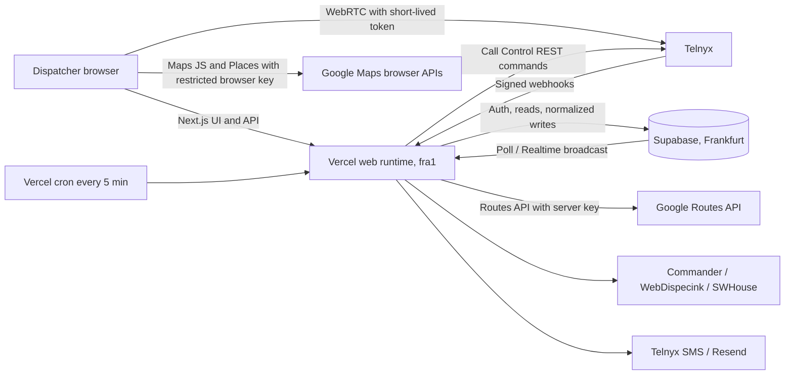
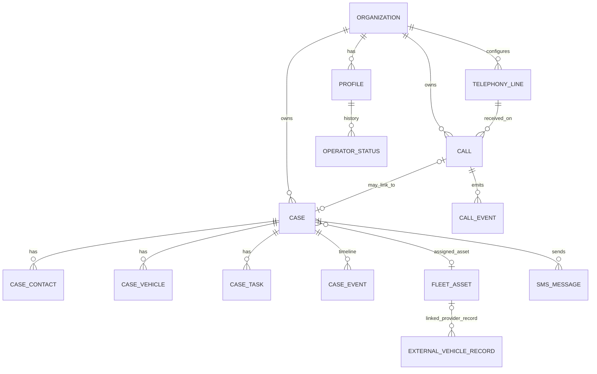

# Pomoc Motoristom Dispatch — AI Project Handoff

This document is a practical orientation guide for a developer or AI assistant joining the project. It describes the current code boundaries, important entities, external systems, and the assumptions that must **not** be made casually.

It is a map, not a substitute for reading the relevant source. The repository changes frequently, especially telephony. Before editing anything, run `git status`, inspect recent commits, and read the files listed for the feature being changed.

## Read this first

1. Read [`AGENTS.md`](./AGENTS.md). It contains repository-specific working and deployment rules.
2. Check the current branch, working tree, and recent history:

   ```bash
   git status --short --branch
   git log -10 --oneline --decorate
   ```

3. Never copy `.env.local`, API keys, database URLs, tokens, WebRTC credentials, or live payloads into prompts, commits, logs, screenshots, or documentation.
4. This repository is the **separate Telnyx copy** of the dispatch app. It has its own Supabase project and its own Vercel project. The original production project, its database, and the previous telephony provider are never referenced from here.
5. Vercel Preview/dev environments use this copy's Supabase project. Writes are real for everyone testing on it, so a preview deployment is **not** a personal sandbox.
6. Do not run a migration, change provider configuration, or add a cron merely because code was edited. Those are separate, explicit operational actions requested by the owner.
7. Some older documents describe intended or historical behavior. Treat the source, current migrations, deployed environment, and live provider evidence as authoritative; verify before relying on an old plan.

## One-minute system picture



The central rule is: **Supabase stores the application truth, the telephony provider owns live telephone truth, and the webhook pipeline reconciles the two.** UI state is not provider confirmation.

Current state (Phase 0 of the Telnyx rollout done): the previous provider is removed, the telephony UI runs in the "Telefónia nie je nakonfigurovaná" mode, SMS sending reports "SMS nie je nakonfigurované", and the Telnyx pipeline is not implemented yet. See [`docs/telnyx-data-contract.md`](./docs/telnyx-data-contract.md).

## Technology and runtime shape

- Next.js 16 App Router, React 19, TypeScript, Tailwind CSS 4.
- Supabase Auth, Postgres, Storage, and normalized application records.
- Telnyx Call Control (REST + signed webhooks), Telnyx WebRTC for the browser phone, Telnyx Messaging for outbound SMS (planned phases).
- Google Maps JavaScript/Places in the browser and Google Routes on the server.
- Fleet integrations: Commander, WebDispecink, and SWHouse.
- Optional downstream call processing through ElevenLabs transcription and Anthropic analysis (disabled; recording is out of scope).
- Vercel hosts the Next.js application in region `fra1`. The production branch is `main`; development and previews follow the release policy in `AGENTS.md` and [`docs/deployment-vercel.md`](./docs/deployment-vercel.md).

The project is a modular monolith: UI, API handlers, business services, provider clients and webhook receivers live in one Next.js repository. There is no separate always-on process; manual jobs run through the one-shot worker entry point and periodic work through a single Vercel cron.

## Repository map

| Path | Responsibility |
| --- | --- |
| `src/app/page.tsx` | Server entry point. Resolves auth, loads dispatch data, and renders the main console. |
| `src/app/api/**/route.ts` | Authenticated server API boundary. Browser mutations should go through these routes. |
| `src/server/route-auth-registry.ts` | Single source of truth for the auth class of every route (`public`, `bearer`, `dual`, `session`). `route-auth.test.ts` and `route-csrf.test.ts` enforce it. |
| `src/components/dispatch/DispatchConsole.tsx` | Main application orchestrator and navigation. Large, stateful, and high-risk to edit casually. |
| `src/components/dispatch/` | Dispatch, cases, tasks, call center, fleet, attendance, reports, maps, and settings UI. |
| `src/components/dispatch/map/` | Map-specific helpers and components. |
| `src/data/dispatch-repository.ts` | Loads and maps the Supabase records used by the dashboard. Also controls mock fallback behavior. |
| `src/data/dispatch-types.ts` | Aggregate data contract passed into the main UI. |
| `src/data/case-inputs.ts` | Case write/input contracts. |
| `src/domain/types.ts` | Main domain types and shared entity shapes. |
| `src/domain/statuses.ts` | Human labels and status mappings. |
| `src/domain/time.ts` | Shared time handling. Use it instead of inventing timezone formatting. |
| `src/server/motorist-mutations.ts` | Core server-side business mutations for cases and related entities. |
| `src/server/api-auth.ts` | Maps Supabase sessions to an active organization profile and enforces roles. |
| `src/server/access-policy.ts` | Role and access-management rules. |
| `src/server/telephony-workflow.ts` | Caller matching, call-to-case linking and call outcomes (provider-neutral). |
| `src/server/telephony-directory.ts` | Contact directory and favourites for the phone panel. |
| `src/server/telephony/` | Call history loading, transcript processing, the transcript-job bearer guard, and the Telnyx stack: `telnyx/` (REST client, Ed25519 signature, client state, command ids, webhook ledger, event processor), `state/` (event parsing, pure reducer, effects), `routing/` (business hours, eligibility, ring plans, reservation), plus `call-actions.ts`, `presence-service.ts`, `operator-devices.ts`, `active-calls.ts`, `session-runner.ts`, `cron-jobs.ts`, `runtime.ts`. |
| `src/server/sms-workflow.ts` + `src/lib/integrations/telnyx/sms-client.ts` | SMS workflow behind the `SmsTransport` seam and the Telnyx transport that implements it. |
| `src/test/fake-supabase.ts`, `src/test/fake-telnyx.ts`, `src/test/telephony-harness.ts` | Offline test harness: in-memory Supabase (queries + the telephony RPCs) and a fake Telnyx client. Telephony tests never touch the network. |
| `src/lib/telephony/` | Browser-side telephony: phone normalization, presence derivation, polling schedule, request helper, directory types, ringtone, the not-configured seam, plus `telnyx-webphone.ts`/`webphone-model.ts` (WebRTC registration and its pure state), `active-calls-model.ts` and `realtime-client.ts`. |
| `src/components/dispatch/PhoneBar.tsx`, `useTelephonyConsole.ts`, `phone-bar-model.ts` | Operator phone bar, the hook that owns webphone + polling + Realtime + call actions, and the pure view helpers behind them. |
| `src/lib/integrations/webdispecink/` | WebDispecink provider adapter. |
| `src/server/integrations/` | Server-side Commander, SWHouse, and other provider services. |
| `src/server/jobs/` | Job registry and schedule for fleet syncs, notifications and transcript processing. |
| `src/worker/` | Scheduler, one-shot job entry point, alerts, and runtime ledger. |
| `supabase/migrations/` | Ordered database schema and RLS changes. |
| `scripts/` | Demo seed and WebDispecink discovery helpers. |
| `tests/`, `e2e/`, colocated `*.test.ts` | Node contract tests, Playwright responsive test, and Vitest unit/route tests. |
| `docs/` | Architecture, data model, integration strategy, deployment runbook, the Telnyx data contract and the Telnyx operations runbook. Some plans may be historical. |

## Application entry and data flow

`src/app/page.tsx` does roughly this:

1. Resolve the current Supabase session and application profile.
2. Show the login UI if no valid actor exists.
3. Call `loadDispatchData()` from `src/data/dispatch-repository.ts`.
4. Pass the aggregate result to `DispatchConsole`.

`DispatchData` contains the dashboard projection: cases, calls, operators, attendance, users, branches, contacts, fleet assets, provider vehicles, notifications, integration health, and metrics.

The repository reports whether data came from `supabase` or `mock`. Missing configuration or a failed Supabase read can produce a mock warning in permitted development contexts. Never treat a nice-looking UI as evidence that live data loaded. Production behavior must fail safely instead of silently presenting demo state.

Browser code generally must not write directly to Supabase. It calls `src/app/api/**`, which authenticates the actor and uses server-only services/credentials.

## Identity, tenancy, and roles

Every business record is scoped by `organization_id`. Do not select or mutate records using an ID alone when organization scope is available.

The important identity distinction is:

- Supabase Auth user: login identity.
- `motorist_profiles`: application identity, role, active state, and organization membership.
- Operator device (planned `motorist_operator_devices`): the browser phone registration owned by a profile; one active device per operator.

Supported application roles are:

- `dispatcher`
- `senior_dispatcher`
- `manager`
- `admin`

Do not assume an authenticated user is automatically an active operator, has a registered phone device, or may perform manager actions. Use `src/server/api-auth.ts` and `src/server/access-policy.ts`.

`MOTORIST_DEV_AUTH_BYPASS` is an explicit local-development escape hatch. It must remain disabled in production and preview-like environments.

## Core entity relationships



Principal table groups include:

- Organization and people: `motorist_organizations`, `motorist_profiles`, organization-profile/access tables, `motorist_operator_statuses`.
- Cases: `motorist_cases`, case contacts/vehicles, `motorist_case_tasks`, `motorist_case_events`.
- Telephony: `motorist_telephony_lines`, `motorist_calls`, `motorist_call_events`, `motorist_call_recordings`, `motorist_call_transcripts`, plus the Telnyx tables (`motorist_call_sessions`, `motorist_call_legs`, `motorist_telnyx_webhook_events`, `motorist_ring_*`, `motorist_business_hours*`, `motorist_ivr_*`, `motorist_operator_presence`, `motorist_operator_devices`, `motorist_callback_requests`, `motorist_telephony_settings`).
- Operations and maps: locations, branches, fleet assets, route estimates, external vehicle records and links.
- Messaging/integrations: `motorist_sms_messages`, `motorist_sms_attempts`, `motorist_integration_raw_events`, `motorist_organization_integrations`, notifications.
- Audit and runtime: `motorist_audit_log`, `motorist_job_*`, `motorist_worker_status`.

Use [`docs/data-model.md`](./docs/data-model.md), the migrations, and `src/lib/supabase/database.types.ts` together. A document can lag behind a migration.

## Cases, tasks, and the dispatcher UI

A call and a case are deliberately different:

- Every real call should have durable history.
- A call may be informational and never become a case.
- A call may link to an existing case or create a new one.
- A case can exist as an incomplete draft and be completed later.

Important UI files:

- `NewCaseDrawer.tsx`: new case workflow.
- `CaseDetail.tsx`: editable detail and autosave behavior.
- `CaseCockpitPanel.tsx`: case detail embedded below the dispatch map.
- `ExpandedCasePanel.tsx`: expanded case view.
- `CaseList.tsx` and `CaseDirectory.tsx`: sidebar/directory listing, search, sorting, and summaries.
- `TaskPanel.tsx`: task creation, filters, and task list.
- `case-form-fields.tsx` and `case-form-shared.ts`: shared field rendering and validation.

The create and edit forms intentionally expose validation while allowing incomplete case drafts. "Invalid/incomplete" is a workflow state, not permission to corrupt typed data. Keep field-level validation and correct input types even when a whole form can be saved unfinished.

Case editing uses autosave patterns. Preserve debouncing, in-flight request handling, retry behavior, and navigation protection. Do not add a second competing save mechanism.

When adding a task, preserve its relationship to the case and the responsible profile. Verify the real database columns before copying a query from a report or old component; past schema assumptions such as nonexistent completion columns have caused runtime failures.

## Telephony mental model

### The words that are easy to confuse

| Term | Meaning in this project |
| --- | --- |
| Line / public number | A telephone number the customer dialled, stored in `motorist_telephony_lines` with a label and partner (e.g. `Allianz Assistance`). Preserve the dialled number exactly; resolve it to a line by exact match after E.164 normalization. |
| Call | Logical application call in `motorist_calls`, correlated by `provider_session_id`. One conversation can span several provider legs. |
| Session / leg | Provider-side call session and its individual legs (customer, operator, consult, external). State transitions are defined on leg rows, never on "the newest call". |
| Ring group / ring plan | Application-owned routing: which operators ring, in which order, for how long, and what happens when nobody answers. The provider has no queue of its own. |
| Presence | Operator availability derived from device registration, presence status and current session (`src/lib/telephony/presence.ts`). |
| Browser phone | WebRTC registration with a per-operator credential and a short-lived server-minted token. One active device per operator per environment; a stale heartbeat gets `409` and the tab disconnects. |
| Profile/operator | The authenticated human. A profile is not the same as a device or a line. |

### What works today

- Provider-neutral: call history (`/api/telephony/calls/history`), caller matching (`/api/telephony/calls/match`), call-to-case linking and outcomes (`/api/telephony/calls/[id]/{link-case,outcome}`), transcripts (`/api/telephony/calls/[id]/transcript`, `/api/telephony/transcripts/process`), directory and favourites (`/api/telephony/directory/**`), QA dashboard shell (`/api/telephony/qa/dashboard`).
- Telnyx (Phase 2): signed webhooks with a claim ledger, the call state machine over sessions and legs, ring plans/groups with business hours and an IVR entry, operator presence and devices, the browser phone (PhoneBar) with click-to-call, internal calls, hold/unhold, blind and attended transfer, park and the waiting room with pickup, outbound SMS with delivery statuses, and Realtime broadcast of call/presence changes.
- Not yet built: the configuration UI for ring plans/hours/IVR (Phase 3), the callback queue UI, add-party/supervision and the wallboard (Phase 4), chaos tests, `telephony/health` and reconciliation (Phase 5).
- Without `TELNYX_API_KEY` every telephony route answers `503` with the Slovak not-configured message and the UI shows the notice (`src/lib/telephony/not-configured.ts`, `notConfiguredTransport` in `src/server/sms-workflow.ts`).

### Command path (Telnyx)

Provider-affecting actions are synchronous but guarded:

1. The browser calls an authenticated, same-origin Next.js telephony route.
2. The server validates the actor, organization, call ownership (or senior role), destination allowlist, rate limit and kill switches (`TELNYX_LIVE_CALLS_ENABLED` plus the database settings row).
3. The server issues the Telnyx command with a deterministic `command_id` and persists the intent.
4. The provider confirms through a signed webhook; the webhook pipeline (claim ledger, per-session lease, reducer) updates the projection.
5. The UI refreshes through polling, and immediately on a Realtime Broadcast message when the channel is connected. It must not announce success merely because a button was clicked.

Serialization is deliberate and load-bearing: PostgREST cannot hold a transaction across the TypeScript reducer, so per-session ordering comes from a lease RPC plus a `version` CAS, and every concurrency-critical decision (webhook claim, operator reservation, ring-step advance) is a single CAS statement in Postgres.

### Call correlation is high risk

A visible telephone conversation can contain several provider legs. Never match a live call using only:

- "the newest call";
- a timestamp rounded to a second;
- caller number alone;
- callee number alone;
- a suffix/partial number match.

Multi-call behavior must be keyed by exact session/leg identity. A single global `incomingCall` boolean or "current call" chosen from an unordered list will leak one operator's call into another operator's UI.

### Telephony safety rules

- Every command records the authenticated actor.
- External phone numbers must be normalized to E.164; short inputs must not be mistaken for public numbers.
- Provider state wins over optimistic UI state.
- Commands that fail are compensated (e.g. failed bridge -> hang up the operator leg and keep the customer waiting), not blindly retried.
- Device registration, presence status and active session are related but separate inputs; "browser connected" does not mean "available".
- Kill switches fail closed: with `TELNYX_LIVE_CALLS_ENABLED=false` or `TELNYX_SMS_LIVE_SENDS=false` no provider-affecting command or SMS is sent.

## Supabase

Supabase provides:

- authentication;
- the operational Postgres database;
- row-level security and organization scoping;
- storage for attachments;
- optional realtime delivery, while parts of the UI still use controlled polling/reloads.

Server clients live under `src/lib/supabase/`. Browser-safe public keys and server-only service credentials are not interchangeable.

Schema changes:

1. This copy's database was created empty for the Telnyx rollout; the kept migrations were edited in place during the provider swap. From Phase 1 onward, add a new timestamped migration and do not rewrite an applied one.
2. Keep changes additive when possible.
3. Regenerate `src/lib/supabase/database.types.ts` (or hand-edit it consistently) after every schema change.
4. Update repository mapping, domain types, validation, mutations, and tests together.
5. Test RLS and role behavior, not only service-role behavior.
6. Applying a migration is a separate action that the owner requests explicitly, and it targets only this copy's Supabase project.

Important: demo/mock data lives in `src/mock/` and repository fallback logic. Mock output must never be confused with a successful production read.

## Telnyx

Telnyx replaces the previous provider and its always-on listener. Everything runs inside Vercel route handlers:

- signed webhooks at `/api/telephony/telnyx/webhook` and `/api/sms/telnyx/webhook` (public routes with Ed25519 verification and an idempotent claim ledger);
- a thin REST client in `src/server/telephony/telnyx/` with timeouts and deterministic command ids;
- a per-operator WebRTC credential and token route for the browser phone;
- one Vercel cron (`*/5 * * * *` -> `/api/telephony/cron`, bearer `CRON_SECRET`) for the ring sweep, stuck-session detection and webhook-ledger retention.

The contract (webhook handling, event classes, state machine, ring tables, command ids, retention) is [`docs/telnyx-data-contract.md`](./docs/telnyx-data-contract.md); the operational procedures (spikes, stuck call, credential rotation, adding a number, raising caps, degraded conference mode, `simulate-inbound`, flipping the kill switches) are [`docs/operations/telnyx-runbook.md`](./docs/operations/telnyx-runbook.md).

Environments are isolated: dev/preview and production each have their own Call Control application, credential connection, outbound voice profile and messaging profile. Identifiers (never secrets) are listed in [`docs/operations/telnyx-setup.md`](./docs/operations/telnyx-setup.md).

Feature gates are intentionally fail-closed. Important names include:

- `TELNYX_LIVE_CALLS_ENABLED` (ANDed with `motorist_telephony_settings.live_calls_enabled`)
- `TELNYX_SMS_LIVE_SENDS` (ANDed with `motorist_telephony_settings.sms_live_sends`)
- `TRANSCRIPTS_ENABLED`
- `SCHEDULER_ENABLED`

Provider-side behavior that application code cannot create includes purchased numbers and their regulatory approval, outbound voice profile limits, and messaging profile sender approval. Obtain provider evidence rather than guessing.

## Maps and locations

There are two Google credentials because there are two trust boundaries:

- `NEXT_PUBLIC_GOOGLE_MAPS_BROWSER_KEY`: restricted by allowed HTTP referrers; used for Maps JavaScript and Places autocomplete.
- `GOOGLE_MAPS_API_KEY`: server-only; used by `/api/maps/route` for Google Routes.
- `NEXT_PUBLIC_GOOGLE_MAPS_MAP_ID`: optional browser map styling/advanced marker ID.

Primary UI files include:

- `GooglePlaceAutocomplete.tsx`
- `LocationPicker.tsx`
- `DispatchMap.tsx`
- `DispatchMapGoogle.tsx`
- `MapWorkspace.tsx`

The case form must remain usable when Places is unavailable. Manual address input is the fallback. Do not require a Google place ID merely to save a case draft. Coordinates, normalized address text, and provider place IDs are related but distinct fields.

Route/distance pricing should use the server route and record whether a value is provider-derived or a fallback estimate. Never present a deterministic fallback as live Google data.

## Fleet and other integrations

### Commander

Commander supplies external vehicle/GPS data, especially replacement vehicles. Its data should remain an external provider record until explicitly linked to a canonical `motorist_fleet_assets` record. Look under `src/server/integrations/commander/` and the corresponding API routes.

### WebDispecink

WebDispecink supplies fleet/position data through a server-side adapter. Credentials are server-only. Discovery and sync code is under `src/lib/integrations/webdispecink/`, `src/server/webdispecink-sync.ts`, and `/api/integrations/fleet/webdispecink/**`.

### SWHouse

SWHouse provides replacement-vehicle/occupancy information. It has its own authentication modes, branch mapping, cache, and sync guard. Look under `src/server/integrations/swhouse/` and `/api/integrations/swhouse/**`.

### SMS and public location links

SMS is server-side through `src/server/sms-workflow.ts` and the `SmsTransport` seam, implemented by `src/lib/integrations/telnyx/sms-client.ts`. The alphanumeric sender is one-way: inbound SMS cannot be received, and delivery statuses arrive at `/api/sms/telnyx/webhook`. Location sharing uses signed/tokenized public links under `src/app/l/` and `/api/public/location-links/**`. Treat location tokens like credentials: do not log them, expose their hashes, or make public routes return unrelated case data.

### Recordings, transcript, and AI

Recording is out of scope for the Telnyx rollout. The transcript and AI steps remain in the code (`src/server/telephony/transcripts-process.ts`) behind `TRANSCRIPTS_ENABLED` and provider keys, and must never block answering, ending, transferring, or saving a call/case.

### Email

Email delivery is abstracted in `src/server/email-delivery.ts`, currently with Resend-related configuration. Do not let an email-delivery failure roll back the underlying business action unless that endpoint explicitly requires atomic delivery.

## Environment-variable families

Use `.env.example` as the inventory and comments. It contains placeholders only; never replace them with real secrets in git.

| Family | Examples | Runtime |
| --- | --- | --- |
| Supabase browser | `NEXT_PUBLIC_SUPABASE_URL`, publishable/anon key | Browser + web |
| Supabase server | service/secret key, project ref, DB URL | Web/worker only |
| App/organization | `APP_BASE_URL`, `DEPLOYMENT_VERSION`, `MOTORIST_ORGANIZATION_ID/SLUG` | Web/worker |
| Telnyx | `TELNYX_API_KEY`, `TELNYX_PUBLIC_KEY`, app/connection/profile IDs, `TELNYX_DEFAULT_FROM_NUMBER`, `TELNYX_SMS_ALPHA_SENDER`, `TELNYX_MEDIA_BASE_URL` | Server only; the browser receives only a short-lived WebRTC token |
| Telnyx safety gates | `TELNYX_LIVE_CALLS_ENABLED`, `TELNYX_SMS_LIVE_SENDS` | Server only, `false` outside production |
| Cron | `CRON_SECRET` | Vercel cron -> server |
| Google | browser Maps key/map ID and server Routes key | Split browser/server |
| Fleet | Commander, WebDispecink, SWHouse credentials and sync secrets | Server/worker only |
| Call processing | `RECORDINGS_SYNC_SECRET` (transcript route guard), ElevenLabs, Anthropic, `TRANSCRIPTS_ENABLED` | Server/worker only |
| Email/monitoring | Resend, alert targets, healthcheck URLs/tokens | Server/worker only |

When an integration appears "configured," distinguish four states:

1. variables exist;
2. the feature gate is enabled;
3. the provider is reachable and authorized;
4. a recent real operation was confirmed.

Only the last state proves it works.

## API and security conventions

- Authenticate with the shared helpers in `src/server/api-auth.ts`.
- Require appropriate roles, not merely any session.
- Enforce same-origin/CSRF rules for browser mutations (`assertSameOriginRequest` before auth).
- Scope every query by organization.
- Validate request bodies at the route/service boundary.
- Rate-limit sensitive public or authentication endpoints.
- Never return provider credentials, raw secret-bearing payloads, service keys, or WebRTC credentials from general endpoints.
- Record the authenticated actor for audited actions and telephony commands.
- Prefer an existing service/mutation module over putting business logic directly in a route handler.
- Register every new route in `src/server/route-auth-registry.ts`; the route-auth and route-csrf tests fail otherwise.

## Common change paths

### Editing case UI

Read `CaseDetail.tsx`, `case-form-fields.tsx`, `case-form-shared.ts`, `case-inputs.ts`, the relevant API route, and `motorist-mutations.ts`. Check both create and edit flows, incomplete drafts, autosave, case panel below the map, and the Cases tab.

### Editing the main dispatch layout

Read `DispatchConsole.tsx`, `MapWorkspace.tsx`, `CaseCockpitPanel.tsx`, both sidebars, and the responsive Playwright test. Test common laptop sizes, not only a large monitor.

### Editing tasks or reports

Verify the actual current task columns in migrations/generated types. Reports should degrade per section rather than failing the whole dashboard because one optional column/table is missing.

### Editing phone behavior

Trace the complete flow: UI -> `useTelephonyConsole` -> API route -> `call-actions`/`event-processor` -> reducer (`state/transitions.ts`) -> effects -> Telnyx command -> provider webhook -> Supabase projection -> UI refresh. Keep the reducer pure and add its case to `transitions.test.ts` on the fake-Supabase harness; never call the real Telnyx API or Supabase from a test. Add tests for inbound and outbound, ringing and answered, one and multiple simultaneous calls, two browser profiles, stale devices, decline, hangup, and transfer. Keep the not-configured and kill-switch modes truthful: no optimistic success anywhere.

### Editing a provider integration

Keep provider payloads in the adapter/server layer. Normalize into canonical entities, preserve raw events only where required for diagnostics, redact secrets, and make retries idempotent.

### Adding a database field

Search first. Then update the migration, generated database type, repository select/mapping, domain/input type, mutation, UI, validation, and tests. Consider existing rows and RLS.

## Verification commands

Use `pnpm` because the lockfile and scripts are pnpm-based.

```bash
pnpm typecheck
pnpm lint
pnpm test
pnpm build
pnpm test:e2e
```

Run the smallest relevant tests while iterating, then the broad gates proportional to risk. Telephony and migration changes deserve the full suite and a build.

Notes:

- `pnpm test` runs Vitest and then `node --test tests/*.test.mjs`. Vitest must run with `NODE_ENV=test` so the auth guards stay active.
- End-to-end tests may need explicit local test authentication and seeded fixtures. Never enable the development auth bypass on a deployed environment to make E2E convenient.
- A successful TypeScript build does not verify provider behavior. Live telephony requires a controlled acceptance matrix and provider evidence.

## Frequent failure modes and false assumptions

- **Mock data looks real:** always inspect the data source/warning.
- **"Credentials present" means healthy:** it does not. Check recent provider confirmation.
- **Browser connected equals available:** false; device registration, presence status and active session are separate inputs.
- **A React state update ended a call:** false until the provider confirms it.
- **One call equals one provider ID:** often false during ringing and transfer; use the session id.
- **Closing a tab ends the call:** not guaranteed; the server owns session state.
- **The newest call belongs to this operator:** unsafe when calls arrive simultaneously.
- **Preview is harmless:** false when it writes to the shared Supabase project of this copy.
- **A map key missing should block case creation:** false; manual location fallback is required.
- **All docs are current:** false; verify code, migrations, environment, and deployment state.
- **A migration is part of a normal frontend deploy:** false; it is a separate, explicitly requested database operation.
- **This copy may reuse the original production project:** never; see `AGENTS.md`.
- **Provider status timestamps are local time:** usually provider/storage timestamps are UTC. Format through shared time utilities for Europe/Bratislava and do not add manual offsets.

## Definition of done by risk level

For an ordinary UI change:

- existing data and actions remain reachable;
- loading, empty, error, long-text, and responsive states work;
- typecheck, lint, targeted tests, and a build pass.

For a case/data change:

- create, incomplete draft, autosave edit, reload, and navigation are tested;
- validation is consistent across create/edit;
- repository and database contract agree;
- permissions and organization scope are verified.

For telephony changes:

- no optimistic success or cross-operator call leakage;
- command actor/ownership/destination validation and kill switches remain intact;
- simultaneous calls and stale devices are covered;
- webhook handling stays idempotent (claim ledger, natural-key upserts);
- a controlled production-like test covers the browser phone and a real mobile endpoint;
- required Supabase, Vercel, and Telnyx portal actions are stated separately.

## Best source documents

- [`AGENTS.md`](./AGENTS.md) — mandatory work/release rules.
- [`README.md`](./README.md) — setup overview and current state.
- [`docs/architecture.md`](./docs/architecture.md) — architectural direction.
- [`docs/data-model.md`](./docs/data-model.md) — table-level model.
- [`docs/domain-model.md`](./docs/domain-model.md) — business entities and statuses.
- [`docs/integration-strategy.md`](./docs/integration-strategy.md) — provider boundaries.
- [`docs/telnyx-data-contract.md`](./docs/telnyx-data-contract.md) — telephony webhook contract, state machine, ring tables and retention.
- [`docs/operations/telnyx-runbook.md`](./docs/operations/telnyx-runbook.md) — telephony operations: spikes, stuck calls, kill switches, credential rotation, caps.
- [`docs/operations/telnyx-setup.md`](./docs/operations/telnyx-setup.md) — Telnyx resource identifiers.
- [`docs/deployment-vercel.md`](./docs/deployment-vercel.md) — Vercel environments and release behavior.

## Suggested first prompt for a new AI assistant

> Read `AGENTS.md` and `AI_PROJECT_HANDOFF.md` completely. Check `git status`, the current branch, and the last 10 commits. Do not edit or deploy anything yet. For my requested feature, identify the UI, API, service, database, cron/job, external-provider, and test files involved. Distinguish verified current behavior from assumptions or old documentation. Never expose secrets, never treat mock data as live, and never make a Supabase/Telnyx/Vercel change unless I explicitly authorize that operational action.

---

Last reviewed against the repository on 2026-09-03 (Phase 2 of the Telnyx rollout). Revalidate rapidly changing telephony and deployment details before acting.
